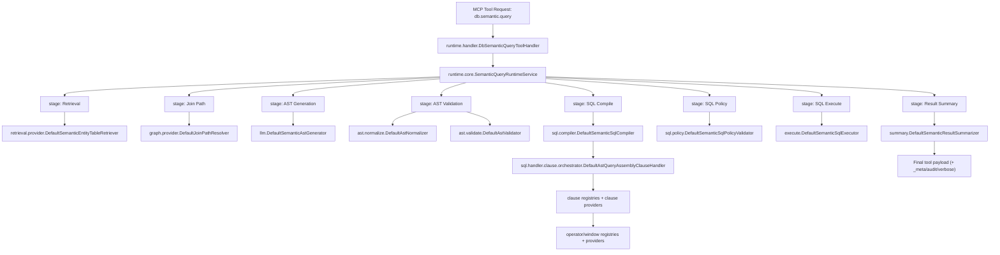

# Semantic Query Package Map

This document explains the package structure and request flow for:

`com.github.salilvnair.convengine.engine.mcp.query.semantic`

It is the reference for where to add new features (AST, retrieval, graph, SQL, runtime stages).

---

## 1) High-Level Flow

1. Runtime receives `db.semantic.query` tool request.
2. Retrieval selects relevant entity/tables.
3. Graph resolves join path.
4. LLM generates AST JSON.
5. AST normalize + validate.
6. SQL compiler orchestrates clause handlers.
7. SQL guardrail validates query safety.
8. SQL executor runs query.
9. Summary formats output payload.

---

## 1.1) Runtime Walkthrough For One SQL Question

Given user question:
`"Show failed disconnect requests in last 24 hours"`

Execution happens in this order:

1. `runtime/handler`
   - `DbSemanticQueryToolHandler` accepts MCP tool call (`db.semantic.query`) and creates runtime context.

2. `runtime/core + runtime/pipeline + runtime/stage/*`
   - `SemanticQueryRuntimeService` runs semantic stage pipeline.
   - Pipeline order:
     - `SemanticRetrievalStage`
     - `SemanticJoinPathStage`
     - `SemanticAstGenerationStage`
     - `SemanticAstValidationStage`
     - `SemanticSqlCompileStage`
     - `SemanticSqlExecuteStage`
     - `SemanticResultSummaryStage`
   - Stage enter/exit/error audit + verbose events are emitted with `_meta`.

3. `retrieval/*`
   - `retrieval/provider/DefaultSemanticEntityTableRetriever` picks top candidate entities/tables.
   - Optional vector similarity via adapters:
     - `PostgresPgVectorSearchAdapter`
     - `NoopSemanticVectorSearchAdapter`
   - Output: `RetrievalResult` with ranked `CandidateEntity`/`CandidateTable`.

4. `graph/*`
   - `graph/provider/DefaultJoinPathResolver` + `JGraphTSchemaGraphEngine` resolve table connectivity and join edges.
   - Output: `JoinPathPlan` (`baseTable`, edges, unresolved tables, confidence).

5. `llm/*`
   - `llm/DefaultSemanticAstGenerator` calls LLM to produce **AST JSON only** (no SQL text).

6. `ast/*`
   - `ast/version/AstCanonicalizer` converts versioned payload (v1) to canonical AST.
   - `ast/normalize/DefaultAstNormalizer` normalizes.
   - `ast/validate/DefaultAstValidator` performs strict checks:
     - entity exists
     - fields valid
     - operator compatibility
     - structural validity (filters/grouping/etc.)

7. `sql/*`
   - `sql/compiler/DefaultSemanticSqlCompiler` orchestrates deterministic compilation.
   - `sql/handler/clause/orchestrator/DefaultAstQueryAssemblyClauseHandler` builds query skeleton.
   - Clause handlers apply:
     - predicates, metrics, windows, exists, subqueries, functions
   - Operator handlers render operator-specific predicates.
   - Window handlers render window-function expressions.
   - Output: `CompiledSql` (parameterized SQL + bind map).

8. `sql/policy`
   - `DefaultSemanticSqlPolicyValidator` and `SqlGuardrail` enforce safety:
     - SELECT-only
     - allowed tables
     - limit boundaries

9. `execute/*`
   - `DefaultSemanticSqlExecutor` executes SQL and returns row payload (`SemanticExecutionResult`).

10. `summary/*`
    - `DefaultSemanticResultSummarizer` creates final response payload returned to tool caller.

11. `model/*` (used across all stages)
    - `SemanticModelLoader` loads semantic YAML.
    - `SemanticModelRegistry` serves model for retrieval, graph planning, validation, and SQL compile.

---

## 1.2) Request Flow By Package (Clear Ownership)

1. `runtime/handler`
   - `DbSemanticQueryToolHandler` receives `db.semantic.query`.

2. `runtime/core + runtime/pipeline + runtime/stage/*`
   - `SemanticQueryRuntimeService` runs stage pipeline in order:
     - Retrieval
     - Join path
     - AST generation
     - AST validation
     - SQL compile
     - SQL policy check
     - SQL execute
     - Result summary

3. `retrieval/*`
   - Finds best entity/tables for the question.
   - `core`: contracts/models (`CandidateEntity`, `CandidateTable`, `RetrievalResult`)
   - `provider`: deterministic + pgvector adapters

4. `graph/*`
   - Resolves schema traversal and join path.
   - `core`: planner/graph contracts (`SchemaGraphEngine`, `JoinPathResolver`, `JoinPathPlan`)
   - `provider`: default resolver + JGraphT engine

5. `llm/*`
   - Generates AST JSON (not SQL) from question + retrieval/join context.

6. `ast/*`
   - Converts and validates AST.
   - `core`: AST input models (`SemanticQueryAstV1`, filters, sorts, operators)
   - `version`: version adapter + canonicalizer (`v1 -> canonical`)
   - `canonical`: normalized internal AST used by compiler
   - `normalize`: default normalization
   - `validate`: strict semantic checks (entity/field/operator validity)

7. `sql/*`
   - Deterministic AST -> parameterized SQL.
   - `core`: compiler contracts + `CompileWorkPlan` + `CompiledSql` + `SqlGuardrail`
   - `compiler`: orchestration compiler
   - `handler/clause/*`: clause rendering (predicate/metric/window/exists/subquery/function)
   - `handler/operator/*`: operator rendering (`EQ/IN/BETWEEN/NULL/etc.`)
   - `handler/window/*`: window function rendering (for example `ROW_NUMBER`)
   - `policy`: SELECT-only, allowed tables, limits
   - `interceptor`: extension hooks

8. `execute/*`
   - Executes compiled SQL and maps rows (`SemanticSqlExecutor`).

9. `summary/*`
   - Converts rows + context into final semantic response payload.

10. `model/*`
   - Loads/serves semantic model used by retrieval, graph, AST validation, and SQL compilation.

---

## 2) Package Tree (Logical)

```text
semantic/
  ast/
    core/         # raw AST contracts/models (v1 payload shape)
    normalize/    # AST normalization contracts + providers
    validate/     # AST validation contracts + providers
    canonical/    # canonical AST model
    version/      # version adapters + canonicalizer

  retrieval/
    core/         # retrieval contracts + candidate/result models + vector adapter contract
    provider/     # deterministic retriever + pgvector/noop adapters + default interceptor

  graph/
    core/         # graph/join planning contracts + edge/plan models
    provider/     # JGraphT engine + default planner/interceptors/resolver

  llm/            # AST generation contracts + default LLM generator/interceptor
  model/          # semantic model contracts + loader/registry/validator

  sql/
    core/         # CompiledSql, CompileWorkPlan, compiler contracts, guardrail, constants
    compiler/     # orchestrator compiler (delegates to handlers)
    policy/       # SQL policy validator
    interceptor/  # SQL compilation interceptors
    handler/
      clause/
        core/     # clause contracts (AstClauseHandler, AstPredicateHandler, ...)
        registry/ # clause registries (sorted Spring bean lists)
        orchestrator/ # query assembly orchestration handler
        provider/ # predicate/metric/window/exists/subquery/function clause providers
      operator/
        core/     # operator handler contracts + registry + context
        provider/ # default EQ/ILIKE/IN/BETWEEN/NULL handlers
      window/
        core/     # window function handler contracts + registry
        provider/ # default ROW_NUMBER handler

  execute/        # SQL execution contracts + default executor
  summary/        # result summarization contracts + default summarizer

  runtime/
    core/         # runtime service + runtime stage interceptor
    handler/      # MCP DB semantic tool handler
    pipeline/     # semantic stage pipeline + factory
    stage/
      core/       # stage contract
      provider/   # retrieval/join/ast/sql/summary stage implementations
```

---

## 3) Sequence Diagram



---

## 4) Where to Add New Features

### A) New AST field (example: expression block)
1. Add model in `ast/core`.
2. Map in `ast/version/V1CanonicalAstMapper`.
3. Validate in `ast/validate/DefaultAstValidator`.
4. Update `llm` schema prompt (`ce_config`) + seeds.
5. Compile via clause/provider handlers in `sql/handler/...`.

### B) New operator (example: `REGEX`)
1. Add enum in `ast/core/AstOperator`.
2. Add default provider under `sql/handler/operator/provider`.
3. Optional custom override provider with higher precedence.

### C) New window function (example: `RANK`)
1. Add provider in `sql/handler/window/provider`.
2. No compiler change required.

### D) New clause behavior (example: HAVING extensions)
1. Add/modify provider in `sql/handler/clause/provider`.
2. Ensure registry includes provider bean.
3. Add validation in `ast/validate`.

### E) New retrieval strategy
1. Implement in `retrieval/provider`.
2. Keep core contract in `retrieval/core`.
3. Plug via Spring bean priority.

### F) New graph backend
1. Implement `graph/core/SchemaGraphEngine` in `graph/provider`.
2. Use higher precedence than default JGraphT provider.

---

## 5) Extension Rules

1. Contracts in `core`; defaults in `provider`.
2. Keep compiler orchestrator-only (`sql/compiler`).
3. Add constants to `sql/core/SemanticSqlConstants` for repeated literals.
4. Prefer handler registration over `switch` growth.
5. Keep runtime stage events and `_meta` payload rich and stable.

---

## 6) Testing Strategy by Layer

1. AST tests:
   - parser/canonicalizer/validator (positive + negative)
2. SQL tests:
   - matrix tests by operator/clause/combination
3. Runtime tests:
   - stage event emission + audit/verbose + `_meta`
4. End-to-end tests:
   - example prompts through full semantic flow

---

## 7) Quick “Who Owns What”

1. `ast/*`: structure correctness
2. `retrieval/*`: relevance selection
3. `graph/*`: join correctness
4. `llm/*`: AST generation only
5. `sql/*`: deterministic SQL build + safety
6. `execute/*`: DB interaction
7. `summary/*`: response shaping
8. `runtime/*`: orchestration and observability
